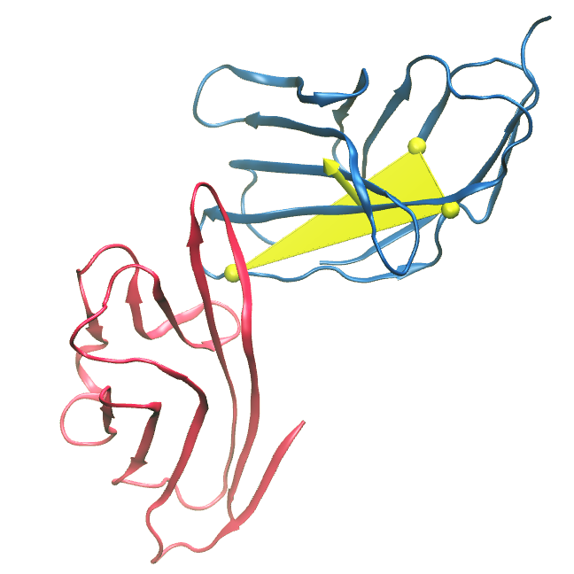

# CD28_Orientations
### Tools to monitor the orientation of protein A in complex to protein B

-------------

Soft requirements: Bash, R, RStudio (to produce the 3D graph). R Library required: 'rgl' (version 0.107.14, in our work, only for graph).

With these two scripts we have computed the orientation of CD28 or CTLA4 with respect to CD80 along an all-atom simulation, as shown in Figure 6E. 

**First**, we simulated the complex of CD80 with CD28 or CTLA4 as described in Methods, and then the simulations were converted with ''*gmx trjconv*'' tool from GROMACS package to *.gro* format containing only coords of CA-atoms (help can be found in https://manual.gromacs.org/documentation/2016.4/onlinehelp/gmx-trjconv.html). Most importantly, to properly monitor the orientations, in this procedure trajectories are centered and fixed on the CA coordinates of CD80 (option *-fit rot+trans* of trjconv) and **all** CA_coords are recorded. The following Rscripts filter the CA-atoms of interest.

As examples, this repo includes two files in *.gro* format of 10ns of CA-atoms trajectories produced as described. You can use this files as input to the following steps.

**Second**, a bash script (*preprocess.sh*) is used to get information from the *.gro* file and produce the input files that will be analysed with the following R script. Give execution permission to this script and run:

    preprocess.sh [filename].gro

The script writes [filename].dat file (input in the next step) and a returns information that you need to add in the following Rscript. This is necessary to properly format the data in the R routine. This information is:
    -  Filename
    -  Number of CA atoms
    -  Number of frames

**Third**, the Rscript (*analysis.R*) computes the orientation of CD28 or CTLA4 with respect to CD80. Open the  script (in RStudio, for example) and follow the instructions. Briefly, after proper rearrangement of the input information, the script compute two vectors: 

- Vector 1: between CAs of residues 102 and 89 of CD28 or CTLA4
- Vector 2: between CAs of residues 102 and 18 of CD28 or CTLA4

This atoms are already selected in the script. Edit to analyse other vectors.

As, shown in the following image, we selected these residues (yellow spheres) because they are conserved positions in CD28 or CTLA4 (in blue ribbon; CD80 in red ribbon) and form a triangle (yellow plane) representative of the orientation of the proteins with repect to CD80 in the complex. This orientation with respect to CD80 (whose rotation and translation was fixed with ''*gmx trjconv*'') is monitored by the normal vector (yellow arrow, the cross product in the *analysis.R*) of the plane formed by Vector 1 and Vector 2. The tip of this vector is plotted in a 3D plot.

The Rscript has to be run in an IDE like RStudio since the plot is produced with the library ''rgl''

This script also writes outputs for every protein in cvs format with the XYZ coords (columns 1-3) of the tip of the normal vector and the distance of CA102 from its original position (column 4, Modulo in the RScript. This is an additional data that is not plotted in the 3D graph produced by this script).

